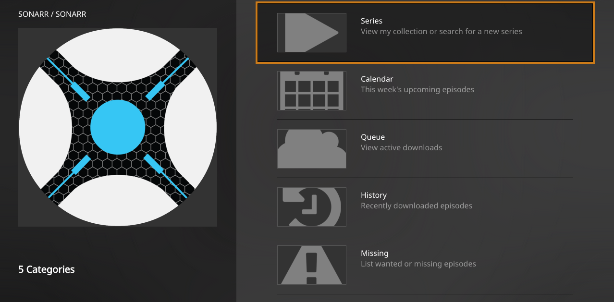

# Sonarr.bundle

A plugin for [Plex Media Server](https://plex.tv/) to control [Sonarr](https://sonarr.tv/) (formally NzbDrone).

## Supports:
- View your TV shows, calendar (current week), queue, missing episodes, and history
- Add new series to your collection (Currently not possible as the newest plex clients hide this field after the massive redesign)
- Search, delete, and update existing shows, seasons, or episodes.

## Install
1. Download "Source Code (zip)" from the [Latest Release](https://github.com/jamorin/Sonarr.bundle/releases/latest).
2. Unzip `Sonarr.bundle-VERSION.zip`
3. Rename `Sonar.bundle-VERSION` to `Sonarr.bundle`
4. Move `Sonarr.bundle` folder to `<PMS Installation>/Library/Application\ Support/Plex\ Media\ Server/Plug-ins` along with the rest of you plugins.
5. Might need to restart Plex Media Server to detect changes.
6. Change the plugin's settings by adding your hostname, port, API Key, etc...

## Alternative Install (`git pull` for updates)
1. `cd <PMS Installation>/Library/Application\ Support/Plex\ Media\ Server/Plug-ins`
2. `git clone https://github.com/jamorin/Sonarr.bundle`
3. Might need to restart Plex Media Server to detect changes.
4. Change the plugin's settings by adding your hostname, port, API Key, etc...

